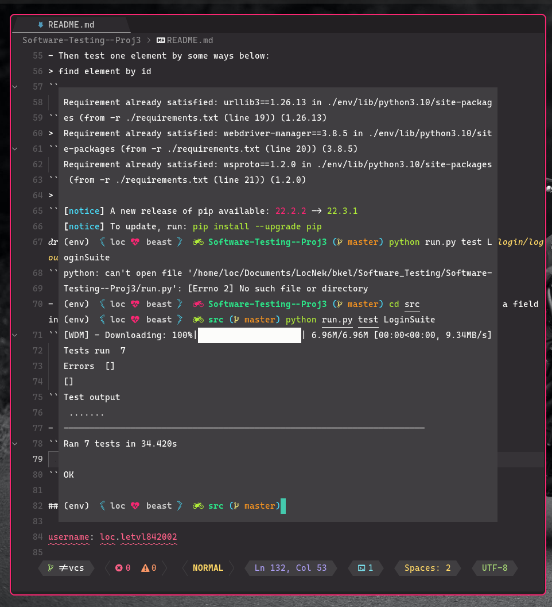
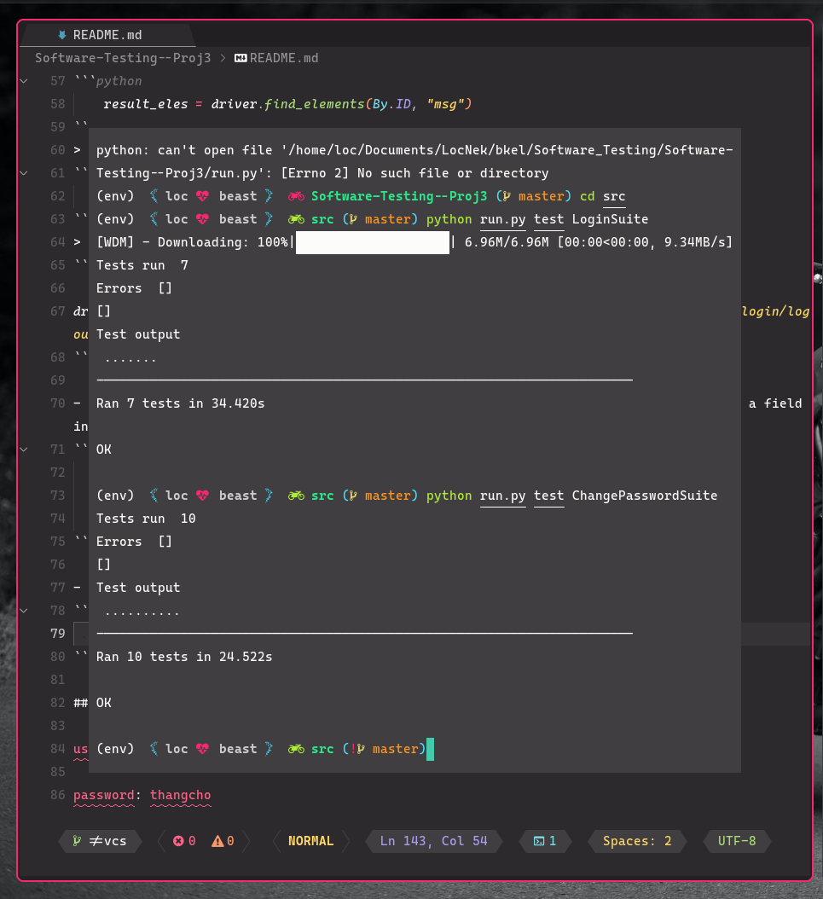

<div align="center">
    <h2>Automation test website <span><a href="https://e-learning.hcmut.edu.vn/">bkel</a> </span>
    </h2>
</div>


## 📦 Installation

```
git clone https://github.com/loctvl842/Software-Testing--Proj3
cd Software-Testing--Proj3
python3 -m venv env
source env/bin/activate
pip install -r ./requirements.txt
```

## 🚀 Usage

Go to `src` folder and run the following commands

> Test login

```sh
python run.py test LoginSuite
```

> Test changing password

```sh
python run.py test ChangePasswordSuite
```

- Read the testcases in folder `testcases`
- Read the result of test in folder `solutions`

Create testcases by changing value in files `LoginSuite.py` and `ChangePasswordSuite.py`

## 🤷‍♀️ Explain

- After installing all dependencies in files `requirements.txt`, import in file `TestUtils.py`:

```python
from selenium import webdriver
from selenium.webdriver.chrome.service import Service
from webdriver_manager.chrome import ChromeDriverManager

from selenium.webdriver.common.keys import Keys
from selenium.webdriver.common.by import By
```

- Get the `driver` by the following command(Make sure to install `Chrome`):

```python
driver = webdriver.Chrome(service=Service(ChromeDriverManager().install()))
```

- In order to test the website, we use the following command:

```python
    driver.get("https://e-learning.hcmut.edu.vn/")
```

- Then test one element by some ways below:
  > find element by id

```python
    result_eles = driver.find_elements(By.ID, "msg")
```

> find element by class name

```python
    driver.find_element(By.CLASS_NAME, "langbutton")
```

> find element by XPath

```python

driver.find_element(By.XPATH, "//a[starts-with(@href, 'https://e-learning.hcmut.edu.vn/login/logout.php')]")
```

- We can also control one element by an action such as: cllcking a button, or inputting a field input. For example:

```python
    driver.find_element(By.ID, "username").clear()
    driver.find_element(By.ID, "username").send_keys("loc.letvl842002")
    driver.find_element(By.NAME, "submit").click()
```

- Beside, we can check if one element is displayed by using the following command:

```python
    powermenu_btn.is_displayed():
```

## 💯 Test Result

<table>
    <thead>
        <tr>
            <th>Login</th>
            <th>ChangePassword</th>
        </tr>
    </thead>
    <tbody>
    <tr>
        <td width="50%">
            </img>
        </td>
        <td width="50%">
            </img>
        </td>
    </tbody>
</table>
